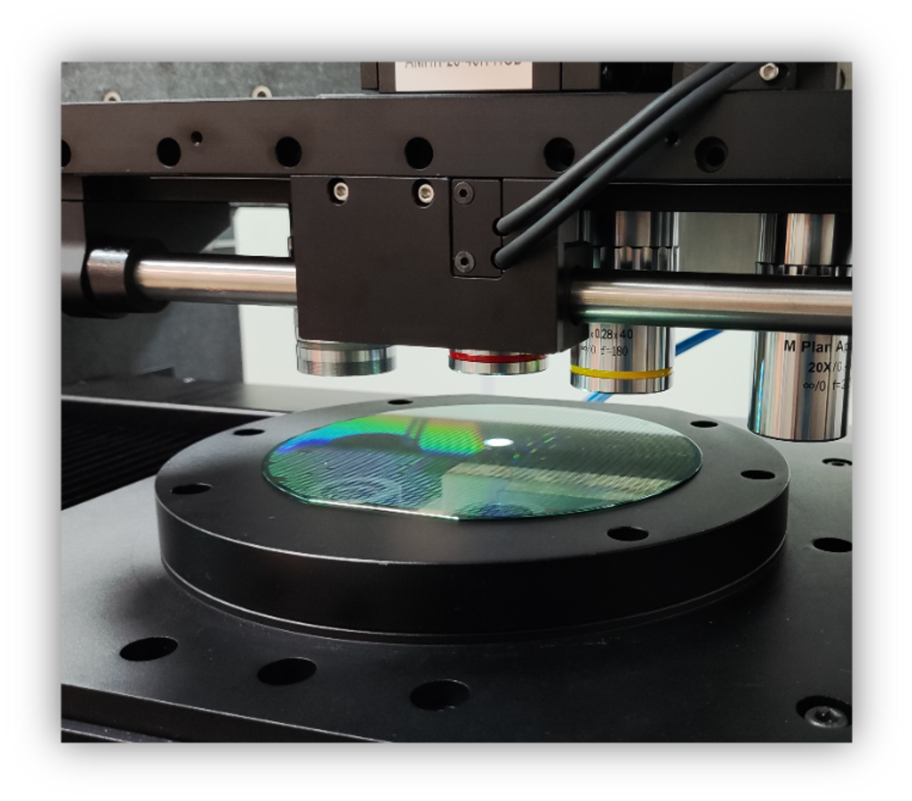
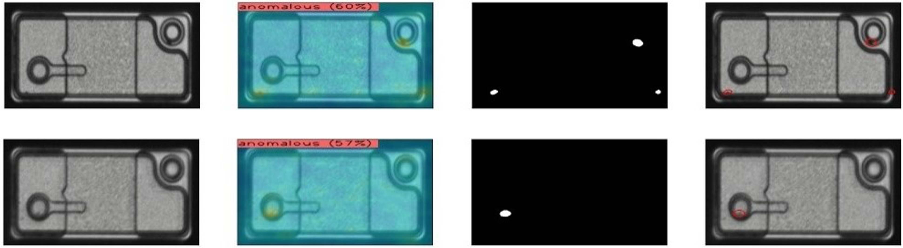
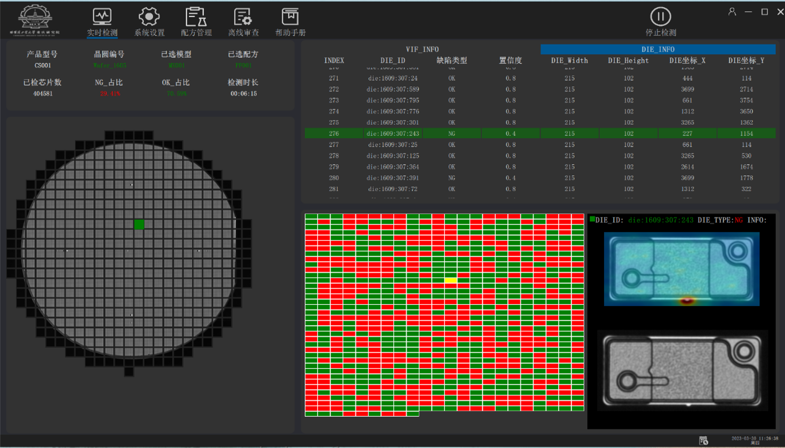

## Project Background

A Micro LED R&D company needs to perform visual inspections on each section of the production process to assess the impact of process changes on the quality of display chips. 

Our developed automatic optical inspection equipment for the surface appearance of wafers supports fast, efficient, and accurate defect detection, classification, and review, which can effectively assist in the iterative development of Micro LED.

## Applications Scenarios
- SiC
- Wafer
- MiniLED/MicroLED
- Glass substrates

## Advantages of the System

### Multi-Dimensional Imaging - Flexible and Freely Combinable Imaging
The imaging system includes various imaging methods such as bright field, dark field, DIC, and PL.

It supports real-time focusing, adopts dual alignment positioning, and uses high-precision cameras with multiple magnification objectives to clearly show defects.

### A.I. Anomaly Detection and Classification

The A.I. system can support the detection of various small, weak, and complex defects, and adapts to normal process variations, providing classifications for common defect types such as hotspots, black spots, hole misalignment, and contamination scratches.

### All-in-one Software
The interface is simple and intuitive, and the operation is smooth and convenient.

There is no need for tedious and lengthy manual modeling. Instead, a data-driven defect detection model is used, which supports dynamic adjustment of the defect detection standards.

## System Specifications

- Size of wafer: 4"/6" or 6"/8"
- Detection accuracy:
  - False Positive Error: <0.5%
  - False Negative Error: <0.5%
- Precision: 1um/pixel@5X or 0.25um/pixel@20X
- Efficiency: 20WPH@6" or 12WPH@8"

Thanks for reading. For more details and inqueries, please contact the project manager listed on the bottom of this page.

