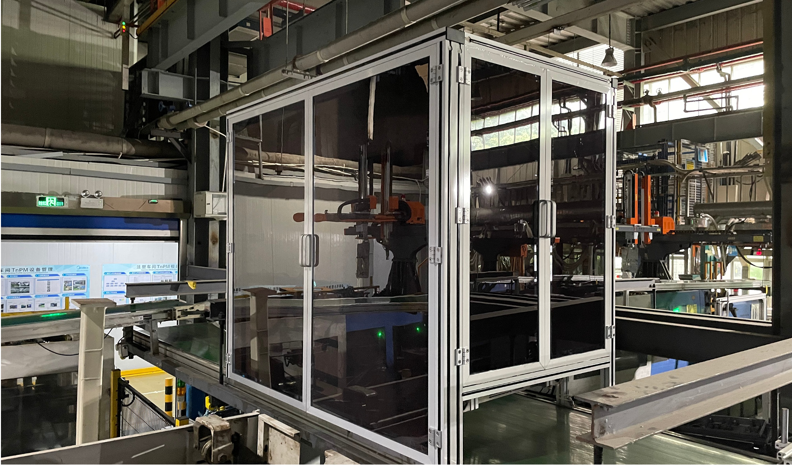
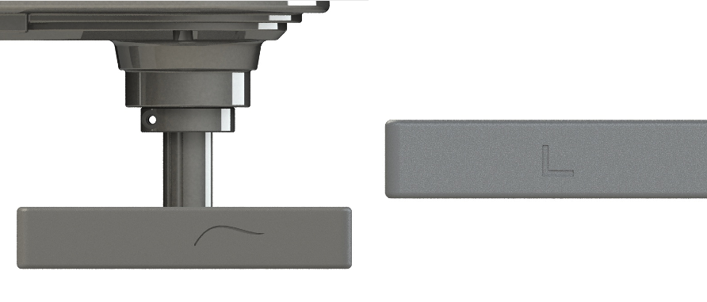
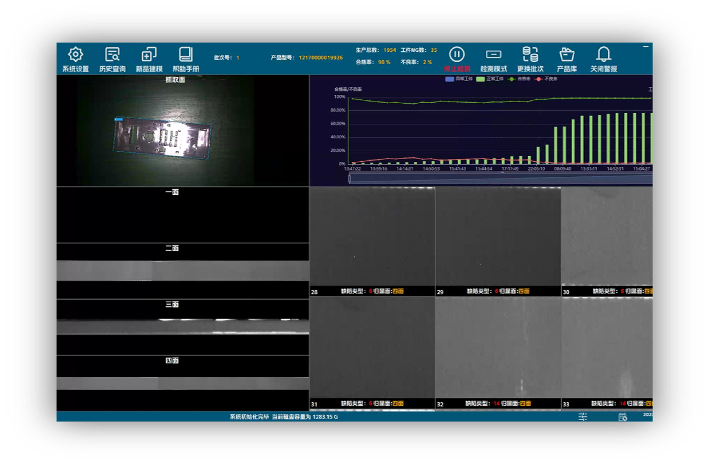
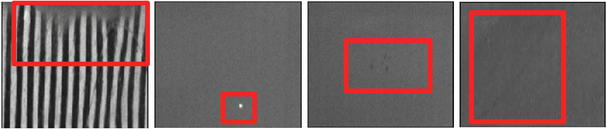
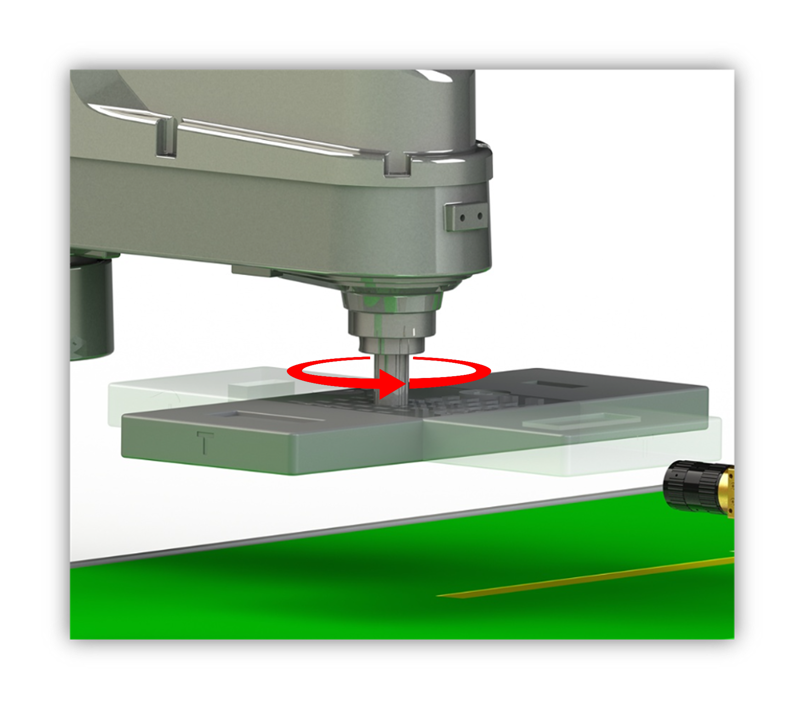
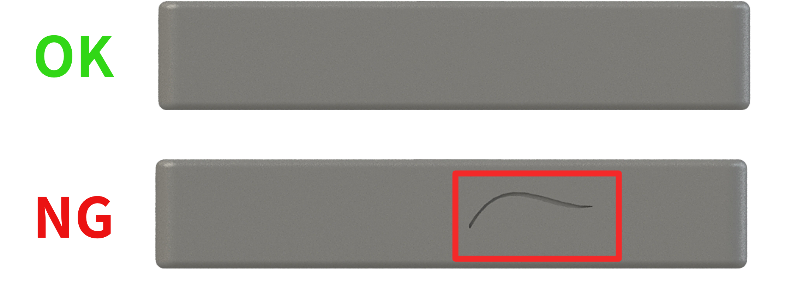
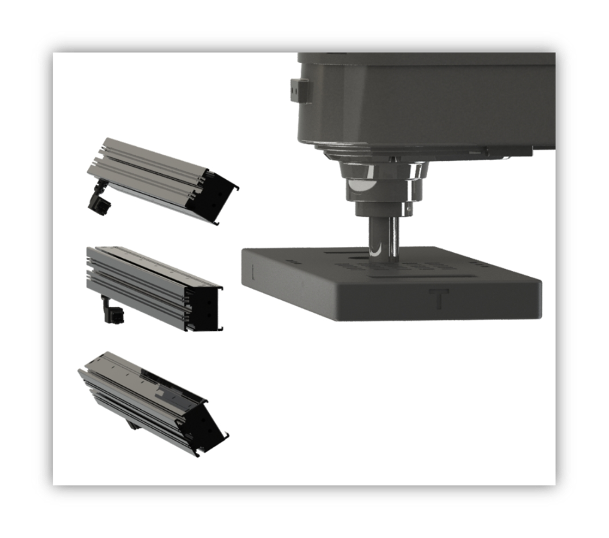
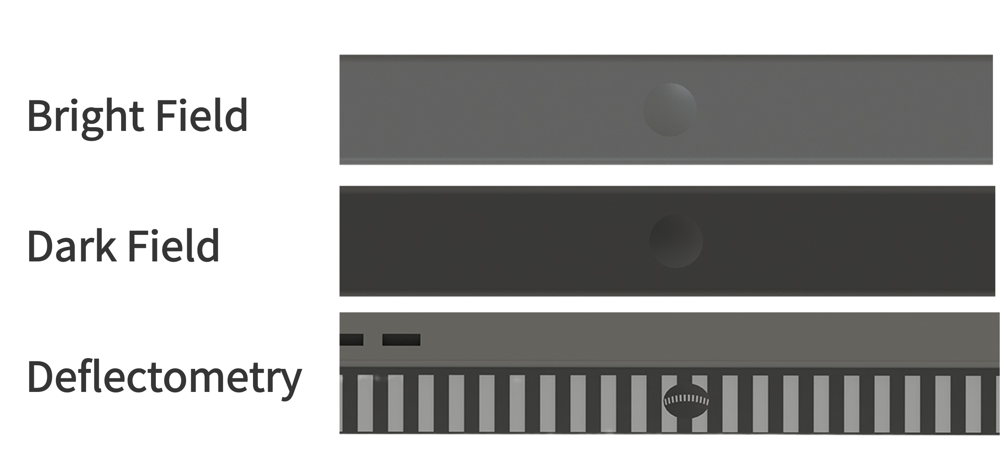

## Project Background

An injection moulding factory needs to upgrade the production of traditional injection moulding machines to an unmanned digital factory. 

On the one hand, the defective products are removed from the production process and automatically packed with good products.

On the other hand, the defect detection information is fed back to the injection moulding machine to improve the yield, of which defect detection becomes a key part.

The injection moulded products are randomly distributed on the conveyor belt and the main inspection surfaces are located around the sides, so the robot is used to track and locate the defects and detect the indispensable defects.

Based on our defect detection algorithm platform and nearly thirty years of experience in vision imaging, the few-shot defect detection algorithm was successfully applied and promoted in an injection moulding factory.

## Applications Scenarios
- Automotive parts
- Electronic components
- Metal processing

## Advantages of the System

### A.I. Detection Algorithm

The system is a **self-developed all-in-one tool for labeling, training and deployment**. 

For classic image processing method:
- Large amounts of defect data are needed, with a high requirement for data balance.
- Manual operation is cumbersome and requires manual annotation of a large amount of data.
- The accuracy is not high, with a large number of false positives and false negatives, and the parameter adjustment is complex.

For our A.I. system:
- Suitable for **few-shot** scenarios in factories.
- Self-developed few-shot deep learning algorithm with **all-in-one easy operation** for data labeling, model training, and deployment.
- **99% high accuracy**, capable of detecting **small**, **low-contrast** defects.

### Visual-Guided Grasping & All-round Detection

The machine hand picks up scattered parts one by one from the conveyor belt and delivers them to a designated inspection area. 

After inspection, the OK parts are placed back on the conveyor belt. 
This system can be used in industries such as **automotive parts, electronic components, and metal processing**.

### Multi-Dimensional Imaging - Flexible and Freely Combinable Imaging

With a powerful self-developed vision system and various image recognition sensors, automatic inspection and component identification can be implemented.

This system can fuse multiple imaging techniques such as ring illumination, bar illumination, coaxial illumination, and backlit illumination, and is compatible with various types of cameras, including area scan and line scan cameras.

## System Specifications

- Inspection Precision: 0.1mm (customizable according to demand)
- Imaging Modality: 2D or 3D (customizable according to demand)
- Capable Detection Tasks: 
  - identification
  - appearence inspection
  - presence/absence detection
  - workpiece sorting
  - other requirements please contact us to inquery

Thanks for reading. For more details and inqueries, please contact the project manager listed on the bottom of this page.

