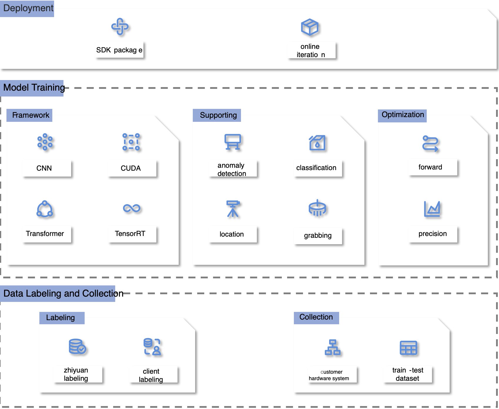
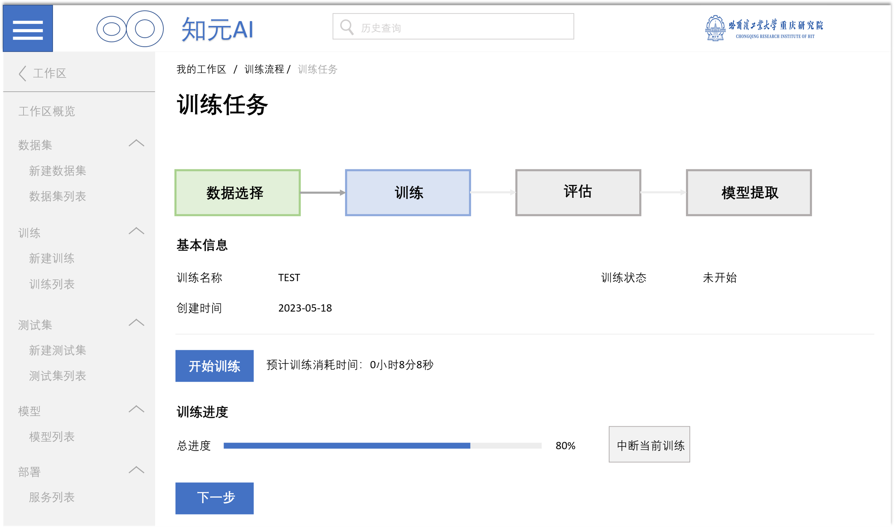

## Introduction

MetaVis AI Platform integrates **traditional image processing** and **deep learning algorithms**, 
focusing on providing **visual inspection solutions** for the **industrial manufacturing sector**. 
It can perform five major functions, including 
- data labeling
- task modeling
- anomaly detection
- defect classification
- defect localization

## Structure of Platform

## Window of Software

## Certificates

Thanks for reading. For more details and inqueries, please contact the project manager listed on the bottom of this page.

