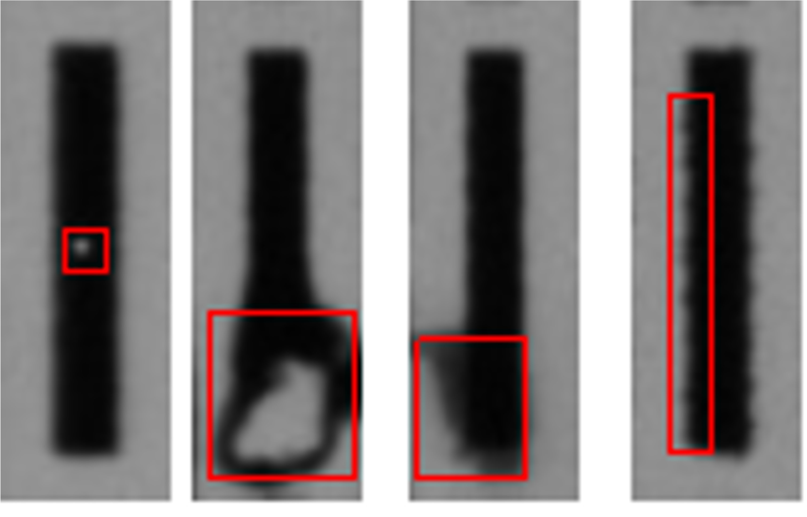

## Product Introduction

The flexible material high-precision inspection system consists of four main components: 
- high-transmission light sources
- high-resolution line-scan cameras
- simple and easy-to-install mechanical structures
- highly stable system software

The system is mainly used for high-precision defect detection of flexible materials. 
It combines deep learning AI algorithms and traditional algorithms to accurately detect fine defects as small as **10um**. 
It is suitable for **quality control** and **product rewinding** on **flexible printing production lines**.

## Application Scenarios

- MLCC
- RFID
- FPC

## Advantages of the System

### High-Precision
The system **solves the problem of deformation in flexible materials** under high-precision imaging conditions and is capable of **detecting fine defects as small as 10um**.

### High Accuracy
With the support of **few-shot learning** and **traditional algorithms**, the detection accuracy reaches **over 98%**.

### Full-surface Online Real-time Inspection
The system can accurately locate **all areas of the image surface**, enabling **full-surface inspection**. 
The average detection time is **less than 800ms**, meeting the requirements for **real-time online inspection**.

### One-click Modeling
With **one-click modeling operation**, the system can **quickly** apply the model to the inspection of **different products**.

## System Specifications

- Inspection Precision: 10um (customizable according to demand)
- Imaging Modality: 
  - Bright/Dark Field
  - Transmissive light
- Capable Defects Types: 
  - Pinholes
  - Burrs
  - Disconnections
  - Glue spills
  - so on

Thanks for reading. For more details and inqueries, please contact the project manager listed on the bottom of this page.

